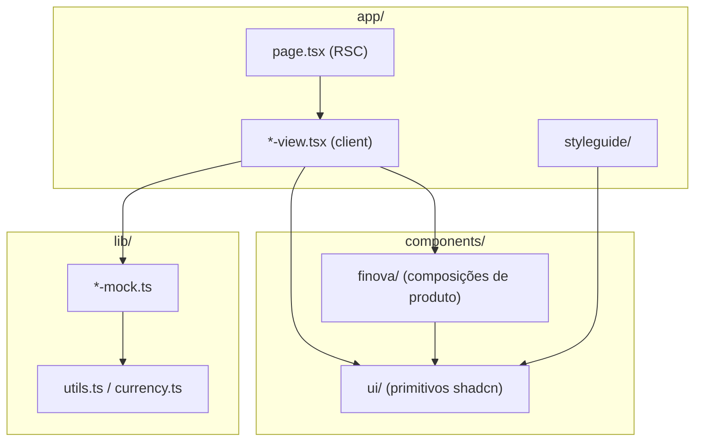
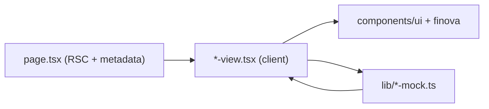

# Arquitetura

O Finova é um sistema de gestão financeira corporativa. No estado atual, é uma aplicação **frontend-only**: toda a interface está implementada, mas os dados, a validação e a "persistência" vivem em mocks em [`lib/`](../lib). Não há backend, API routes, autenticação ou camada de dados remota.

## Stack

| Camada | Tecnologia | Versão |
|--------|------------|--------|
| Framework | [Next.js](../package.json) (App Router) | 16.2.4 |
| UI | React / React DOM | 19.2.4 |
| Linguagem | TypeScript | 5 |
| Estilo | Tailwind CSS (via `@tailwindcss/postcss`) | 4 |
| Design System | shadcn/ui (style `radix-maia`) + Radix UI (`radix-ui`) | — |
| Variantes | `class-variance-authority`, `clsx`, `tailwind-merge` | — |
| Ícones | `@hugeicons/react` + `@hugeicons/core-free-icons` | — |
| Tabelas | `@tanstack/react-table` | 8 |
| Gráficos | `recharts` | 3 |
| Drawer | `vaul` | 1 |
| Datas | `date-fns` + `react-day-picker` | — |
| Command palette | `cmdk` | — |

Os scripts disponíveis (`dev`, `build`, `start`, `lint`) estão em [`package.json`](../package.json). O pacote é privado e nomeado `design-system`.

## Camadas

| Camada | Responsabilidade |
|--------|------------------|
| [`app/`](../app) | Rotas do App Router. Cada rota de produto é um Server Component fino (`page.tsx`) que define `metadata` e delega a UI para um Client Component (`*-view.tsx`). |
| [`components/ui/`](../components/ui) | Primitivos do Design System baseados em shadcn/ui e Radix. Sem lógica de domínio. |
| [`components/finova/`](../components/finova) | Composições de produto (shell, sidebar, empty states, drawers) que combinam primitivos para o domínio financeiro. |
| [`lib/`](../lib) | Utilitários (`cn`, formatação de moeda) e camada de dados mock: tipos, constantes, validação e factories. |
| [`app/styleguide/`](../app/styleguide) | Documentação viva do Design System (tokens e showcases de componentes). |

O detalhamento de cada diretório está em [project-structure.md](project-structure.md).

## Fluxo de dados

O padrão de fluxo é local e síncrono, sem rede:

Valores monetários circulam em **centavos** (`amountCents`, `limitCents`) e são formatados para BRL apenas na exibição, via [`lib/currency.ts`](../lib/currency.ts). A gestão de estado é detalhada em [state-management.md](state-management.md).

## Limitações atuais

Estas são características reais do estado do projeto, relevantes para planejar a evolução:

- **Sem backend:** não existem `app/api/`, route handlers, `fetch`, nem integração com Supabase ou outro serviço.
- **Sem autenticação:** não há rotas de login nem `middleware.ts`. O usuário "Ana Boutik" é mock.
- **Sem persistência:** formulários operam sobre estado React efêmero; ações como salvar configurações fazem `console.log`.
- **Tema dark fixo no root:** [`app/layout.tsx`](../app/layout.tsx) aplica a classe `dark` no `<html>`; o toggle light/dark existe no styleguide e em Configurações, mas não persiste globalmente.

As implicações de produto dessas limitações estão registradas em [roadmap.md](roadmap.md); as decisões de arquitetura estão em [decisions/](decisions).
